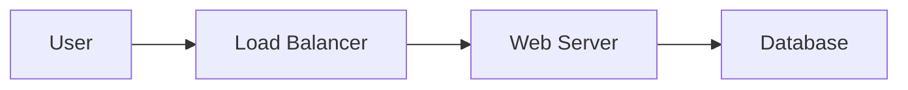
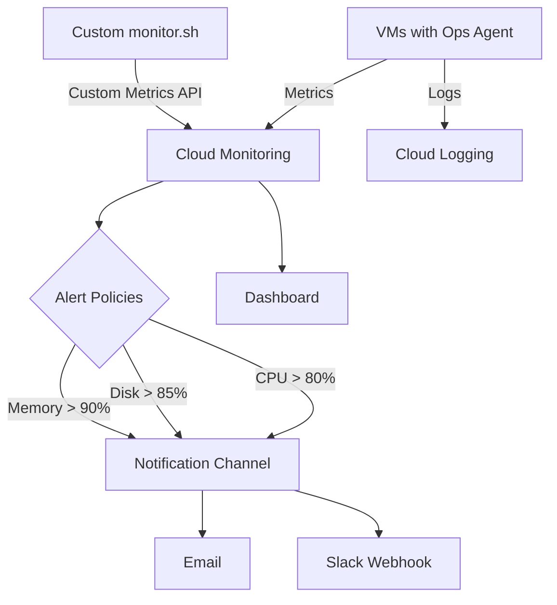

# Day 44 — Improve READMEs & Diagrams

> **Week 8 — Portfolio & Review** | ⏱ 2 hours | Region: `europe-west2`

---

## Part 1 — Concept (30 min)

### Why READMEs Matter

Your portfolio projects are only as good as their documentation. A recruiter or interviewer will look at your README **before** reading any code. A clean README signals professionalism and communication skills.

**Linux analogy:**

| Bad | Good |
|---|---|
| Script with no comments | Script with header, usage, examples |
| `README: run the thing` | README with architecture, setup, troubleshooting |
| "It's obvious from the code" | Explained for someone seeing it for the first time |

### README Template

```
┌──────────────────────────────────────────────────────────┐
│              Portfolio README Structure                    │
│                                                          │
│  1. TITLE + BADGES                                       │
│     Project name, one-line description                   │
│     Status badge, Terraform version badge                │
│                                                          │
│  2. WHAT (30 seconds)                                    │
│     What does this project do?                           │
│     2-3 sentences maximum                                │
│                                                          │
│  3. WHY (30 seconds)                                     │
│     What problem does it solve?                          │
│     What did you learn?                                  │
│                                                          │
│  4. ARCHITECTURE (60 seconds)                            │
│     Diagram (ASCII, Mermaid, or draw.io)                 │
│     Key components listed                                │
│                                                          │
│  5. TECH STACK (10 seconds)                              │
│     GCP services, Terraform, Bash                        │
│                                                          │
│  6. USAGE (2 minutes)                                    │
│     Prerequisites, setup, deploy commands                │
│                                                          │
│  7. KEY DECISIONS (1 minute)                             │
│     Why certain choices were made                        │
│     Trade-offs considered                                │
│                                                          │
│  8. TROUBLESHOOTING (reference)                          │
│     Common errors and fixes                              │
│                                                          │
│  9. CLEANUP (reference)                                  │
│     How to tear everything down                          │
└──────────────────────────────────────────────────────────┘
```

### Diagram Tools

| Tool | Format | Best For | Portfolio Use |
|---|---|---|---|
| **ASCII art** | Text | Quick diagrams, works everywhere | In-code docs |
| **Mermaid** | Markdown | GitHub renders natively | README.md diagrams |
| **draw.io** | PNG/SVG | Detailed architecture diagrams | Blog posts, presentations |
| **Google Slides** | PNG | Quick + branded | Presentations |

### Mermaid Basics (GitHub-Native)

Mermaid diagrams render directly in GitHub READMEs:

````markdown

````

### Diagram Types for Infrastructure

```
┌─────────────────────────────────────────────────────────┐
│          Which Diagram to Use                           │
│                                                         │
│  NETWORK TOPOLOGY:                                      │
│  "How do components connect?"                           │
│  → Boxes for VMs/services, lines for connections        │
│  → Show VPCs, subnets, firewalls                        │
│                                                         │
│  FLOW DIAGRAM:                                          │
│  "How does data/traffic flow?"                          │
│  → Arrows showing request path                          │
│  → Show protocols and ports                             │
│                                                         │
│  SEQUENCE DIAGRAM:                                      │
│  "What happens in order?"                               │
│  → Startup script execution order                       │
│  → Backup/restore procedure steps                       │
│                                                         │
│  COMPONENT DIAGRAM:                                     │
│  "What makes up this system?"                           │
│  → Terraform modules, scripts, configs                  │
│  → How they relate to each other                        │
└─────────────────────────────────────────────────────────┘
```

---

## Part 2 — Hands-On Lab (60 min)

### Goal: Rewrite READMEs for 3 Projects from Weeks 1-7

### Project 1: Secure VPC (Week 2)

```bash
cat > /tmp/secure-vpc-README.md << 'README_EOF'
# Secure VPC Landing Zone

Production-ready VPC with private subnets, IAP-only SSH access, Cloud NAT for egress, and flow logging — deployed via Terraform.

## What

A hardened VPC network on GCP with:
- Custom subnet (10.0.1.0/24) in `europe-west2`
- Firewall: SSH via IAP only (no public SSH)
- Firewall: HTTP/HTTPS from internet (tagged VMs only)
- Default deny all ingress
- Cloud NAT for private VM internet access
- VPC Flow Logs enabled for audit

## Why

Every production workload needs a secure network foundation. This project demonstrates:
- Defence-in-depth (no public IPs + IAP + firewall rules)
- Least-privilege network access
- Audit trail via flow logs
- Infrastructure as Code with Terraform

## Architecture

```
                      Internet
                         │
                    ┌────▼────┐
                    │ Cloud   │
                    │ NAT     │ (egress only)
                    └────┬────┘
                         │
┌────────────────────────┼──────────────────────────┐
│  VPC: secure-vpc       │       europe-west2       │
│                        │                          │
│  ┌─────────────────────▼───────────────────────┐  │
│  │  Subnet: secure-subnet (10.0.1.0/24)       │  │
│  │                                             │  │
│  │  ┌──────────┐  ┌──────────┐                 │  │
│  │  │ web-vm   │  │ app-vm   │  (no public IP) │  │
│  │  │ tag:http │  │ tag:ssh  │                 │  │
│  │  └──────────┘  └──────────┘                 │  │
│  └─────────────────────────────────────────────┘  │
│                                                    │
│  Firewall Rules:                                   │
│  ✓ allow-ssh-iap:  tcp/22 from 35.235.240.0/20   │
│  ✓ allow-http:     tcp/80,443 from 0.0.0.0/0     │
│  ✗ deny-all:       default deny ingress           │
└────────────────────────────────────────────────────┘
```

## Tech Stack

| Component | Technology |
|---|---|
| IaC | Terraform ~> 5.0 |
| Cloud | Google Cloud Platform |
| Region | europe-west2 (London) |
| Services | VPC, Cloud NAT, Cloud Router, IAP |

## Usage

### Prerequisites
- GCP project with billing enabled
- `gcloud` CLI authenticated
- Terraform >= 1.5 installed

### Deploy

```bash
cd environments/dev
cp terraform.tfvars.example terraform.tfvars
# Edit terraform.tfvars with your project ID

terraform init
terraform plan
terraform apply
```

### Test SSH via IAP

```bash
gcloud compute ssh web-vm --zone=europe-west2-a --tunnel-through-iap
```

## Key Decisions

| Decision | Rationale |
|---|---|
| IAP-only SSH | No public SSH exposure; identity-aware access |
| Cloud NAT (no public IPs) | VMs can reach internet for updates without being exposed |
| Flow Logs enabled | Audit and compliance requirement |
| /24 subnet | 254 hosts — enough for small workloads, easy to expand |

## Troubleshooting

| Issue | Fix |
|---|---|
| Can't SSH via IAP | Check IAP firewall rule, verify `roles/iap.tunnelUser` IAM |
| VM can't reach internet | Check Cloud NAT is attached to the router |
| Terraform destroy hangs | Check for resources with `deletion_protection = true` |

## Cleanup

```bash
terraform destroy -auto-approve
```
README_EOF

echo "Secure VPC README written"
```

### Project 2: Monitoring Pack (Week 3)

```bash
cat > /tmp/monitoring-pack-README.md << 'README_EOF'
# GCP Monitoring Pack

Automated Cloud Monitoring setup with custom dashboards, alerting policies, and notification channels — for VM infrastructure monitoring.

## What

A monitoring solution for GCP Compute Engine that includes:
- Ops Agent installation for CPU, memory, disk metrics
- Custom monitoring script for application-level checks
- Alert policies for CPU > 80%, Disk > 85%, Memory > 90%
- Email + Slack notification channels
- Pre-built dashboard for fleet overview

## Why

Default GCP monitoring lacks application-level checks and custom alerting. This project demonstrates:
- Full observability stack (metrics + logs + alerts)
- Custom metrics via the Monitoring API
- Automated deployment of monitoring alongside VMs
- Operational maturity (same approach used in production environments)

## Architecture



## Tech Stack

| Component | Technology |
|---|---|
| Metrics Agent | Ops Agent (google-cloud-ops-agent) |
| Custom Monitoring | Bash script + Cloud Monitoring API |
| Alerts | Cloud Monitoring Alert Policies |
| IaC | Terraform + gcloud |
| Region | europe-west2 |

## Usage

### Deploy Monitoring

```bash
# Install Ops Agent on a VM
gcloud compute ssh VM_NAME --zone=europe-west2-a --command="
  curl -sSO https://dl.google.com/cloudagents/add-google-cloud-ops-agent-repo.sh
  sudo bash add-google-cloud-ops-agent-repo.sh --also-install"

# Deploy custom monitoring script
gcloud compute scp scripts/monitor.sh VM_NAME:/opt/monitor.sh --zone=europe-west2-a
```

### Create Alert Policy

```bash
gcloud monitoring policies create --policy-from-file=alerts/cpu-alert.json
```

## Key Decisions

| Decision | Rationale |
|---|---|
| Ops Agent over legacy agents | Unified metrics + logging, Google-recommended |
| Custom script alongside Ops Agent | Application-specific checks not in standard metrics |
| 5-minute monitoring interval | Balance between granularity and API cost |
| Multiple notification channels | Redundancy — email if Slack is down |

## Cleanup

```bash
terraform destroy -auto-approve
# Delete alert policies manually if created via gcloud
```
README_EOF

echo "Monitoring Pack README written"
```

### Project 3: Golden VM Automation (Week 7)

```bash
cat > /tmp/golden-vm-README.md << 'README_EOF'
# Golden VM Baseline Automation

Automated VM provisioning with hardened OS, monitoring, log rotation, and ops scripts — deployed via startup scripts from GCS and managed with Terraform.

## What

An end-to-end automated VM baseline that provisions production-ready VMs with:
- Package installation (nginx, fail2ban, auditd, htop)
- SSH hardening (no root login, no password auth, max 3 attempts)
- Kernel hardening (sysctl security parameters)
- Monitoring script (disk, memory, CPU) running via cron
- Log rotation for all custom logs
- Disk cleanup script running weekly
- Unattended security upgrades

## Why

Manual VM setup is error-prone and inconsistent. This project solves the "works on my VM" problem by ensuring every VM is identically configured through automation. Key learning outcomes:
- Idempotent startup scripts (safe to re-run on every boot)
- Defence-in-depth hardening (CIS-inspired)
- Operational automation (monitoring + housekeeping from day one)

## Architecture

```
┌─────────────────────────────────────────────────────┐
│               Golden VM Architecture                │
│                                                     │
│  GCS Bucket (scripts)                               │
│  ├── golden-setup.sh                                │
│  ├── monitor.sh          ┌──────────────────────┐   │
│  ├── disk-cleanup.sh     │   Golden VM           │   │
│  └── logrotate.conf  ──► │                       │   │
│                          │  ✓ Packages installed │   │
│  Terraform               │  ✓ SSH hardened       │   │
│  ├── Instance Template   │  ✓ Kernel hardened    │   │
│  ├── Snapshot Policy ──► │  ✓ fail2ban active    │   │
│  └── GCS Bucket          │  ✓ auditd running     │   │
│                          │  ✓ Monitoring (cron)  │   │
│                          │  ✓ Log rotation       │   │
│                          │  ✓ Disk cleanup       │   │
│                          └──────────────────────┘   │
└─────────────────────────────────────────────────────┘
```

## Tech Stack

| Component | Technology |
|---|---|
| Provisioning | Terraform + Instance Templates |
| Configuration | Bash startup scripts (idempotent) |
| Script Storage | Cloud Storage (GCS) |
| Monitoring | Custom script + Cloud Monitoring API |
| Hardening | CIS-inspired SSH + kernel + audit rules |
| Region | europe-west2 |

## Usage

### Prerequisites
- GCP project with Compute Engine API enabled
- `gcloud` CLI + Terraform installed
- `gsutil` for script upload

### Deploy

```bash
# 1. Upload scripts to GCS
gsutil mb -l europe-west2 gs://PROJECT-golden-scripts/
gsutil cp scripts/*.sh gs://PROJECT-golden-scripts/

# 2. Deploy with Terraform
cd environments/prod
terraform init
terraform plan -var="scripts_bucket=PROJECT-golden-scripts"
terraform apply

# 3. Verify
gcloud compute ssh INSTANCE --zone=europe-west2-a --command="
  [ -f /opt/.golden-setup-v1.0-complete ] && echo PASS || echo FAIL"
```

## Verification Checklist

```
[ ] Startup script marker exists
[ ] nginx running (systemctl is-active nginx)
[ ] fail2ban running
[ ] auditd running with rules
[ ] SSH: PermitRootLogin no
[ ] Kernel: ip_forward = 0
[ ] Monitor script in cron (*/5 * * * *)
[ ] Log rotation configured
[ ] Disk cleanup in cron (weekly)
```

## Key Decisions

| Decision | Rationale |
|---|---|
| Scripts in GCS (not inline metadata) | Versioned, shared, no 256KB limit |
| Guard file for idempotency | Startup scripts run on every boot |
| CIS-inspired (not full CIS) | Practical subset for portfolio projects |
| fail2ban for SSH protection | Complements firewall rules at OS level |

## Troubleshooting

| Issue | Diagnosis | Fix |
|---|---|---|
| Startup script didn't run | Check serial output | Verify GCS permissions (storage-ro scope) |
| Packages not installed | Check `/var/log/golden-setup.log` | Manual re-run: `google_metadata_script_runner startup` |
| Monitoring gaps | Check `/var/log/monitor-cron.log` | Verify cron service running + permissions |

## Cleanup

```bash
terraform destroy -auto-approve
gsutil rm -r gs://PROJECT-golden-scripts/
```
README_EOF

echo "Golden VM README written"
```

### Step 4 — Review and Compare

```bash
echo "=== README files created ==="
for f in /tmp/secure-vpc-README.md /tmp/monitoring-pack-README.md /tmp/golden-vm-README.md; do
  echo ""
  echo "--- $(basename $f) ---"
  echo "Lines: $(wc -l < $f)"
  echo "Sections: $(grep -c '^##' $f)"
done
```

### Cleanup

```bash
rm -f /tmp/secure-vpc-README.md /tmp/monitoring-pack-README.md /tmp/golden-vm-README.md
```

---

## Part 3 — Revision (15 min)

### Key Concepts

- **README is the front door** — first thing reviewers/interviewers see
- Structure: What → Why → Architecture → Tech → Usage → Decisions → Troubleshooting → Cleanup
- **Architecture diagrams** are essential — ASCII, Mermaid, or draw.io
- **Mermaid** renders natively on GitHub — use it in README.md
- Include **Key Decisions** section — shows you THINK, not just copy
- **Troubleshooting** section shows operational maturity
- Keep it scannable: tables, bullets, code blocks

### README Checklist

```
[ ] One-line description (what + value)
[ ] Architecture diagram (visual)
[ ] Tech stack table
[ ] Prerequisites listed
[ ] Deploy commands (copy-paste ready)
[ ] Key decisions with rationale
[ ] Troubleshooting table
[ ] Cleanup commands
```

---

## Part 4 — Quiz (15 min)

<details>
<summary><strong>Q1: An interviewer opens your GitHub repo. They spend 30 seconds on the README. What must they learn in that time?</strong></summary>

**Answer:** In 30 seconds, the README must convey:

1. **What it does** — one sentence: "Production-ready VPC with IAP-only SSH and Cloud NAT"
2. **Why it matters** — "Demonstrates secure-by-default network design"
3. **Architecture** — a diagram showing the high-level components
4. **Tech stack** — "Terraform, GCP, europe-west2"

Everything below the fold (Usage, Troubleshooting) is for deeper review. The top section decides whether they keep reading or move on.

**Anti-patterns to avoid:**
- No README at all
- README that starts with "Prerequisites: install terraform..."
- README that's just a wall of commands with no context
</details>

<details>
<summary><strong>Q2: When should you use Mermaid diagrams vs ASCII art vs draw.io?</strong></summary>

**Answer:**

| Tool | Best For | Trade-off |
|---|---|---|
| **ASCII art** | Inline in code comments, works everywhere | Limited visual appeal, manual layout |
| **Mermaid** | GitHub READMEs, auto-rendered, version-controlled | Limited styling, can look cluttered for complex diagrams |
| **draw.io** | Detailed architecture diagrams, presentations | Binary file in Git (or XML), harder to version control |

**Recommendation for portfolio:**
- **Main README:** Mermaid (GitHub renders it, looks professional)
- **Code comments / markdown study notes:** ASCII art (always works)
- **Presentations / blog posts:** draw.io export to PNG/SVG
</details>

<details>
<summary><strong>Q3: Why include a "Key Decisions" section? Isn't the code self-explanatory?</strong></summary>

**Answer:** Code shows **what** you did, not **why**. The Key Decisions section demonstrates:

1. **Critical thinking** — "I chose IAP over public SSH because..." shows you evaluated alternatives
2. **Trade-off awareness** — "Cloud NAT adds cost but removes attack surface" shows engineering maturity
3. **Interview prep** — these decisions become talking points: "Walk me through your architecture"
4. **Team value** — future maintainers understand intent, not just implementation
5. **Differentiation** — anyone can copy Terraform from a tutorial. Explaining WHY separates you from the crowd.
</details>

<details>
<summary><strong>Q4: You have 7 project READMEs to write for your portfolio. How do you ensure consistency across all of them?</strong></summary>

**Answer:**

1. **Create a template** — standardise sections, headings, and order (this day's template)
2. **Consistent tech stack table** — same columns across all projects
3. **Consistent architecture diagram style** — all ASCII, or all Mermaid
4. **Consistent section names** — "Usage" not "How to Use" / "Getting Started" / "Setup"
5. **Consistent code formatting** — all bash blocks use `bash` language tag
6. **Batch write** — don't write one perfectly then rush the rest. Write all drafts first, then polish

**Quality check:** Open all 7 READMEs side by side and verify they look like they were written by the same person with the same standards.
</details>
