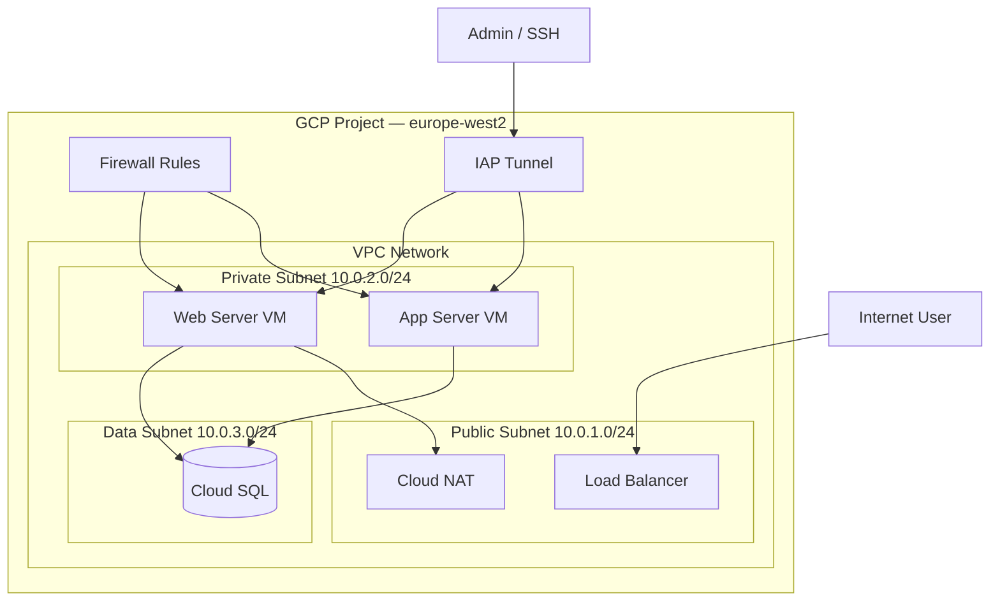
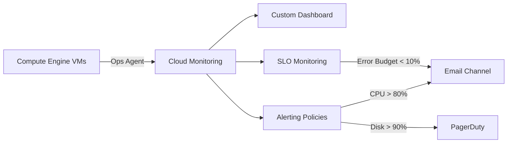
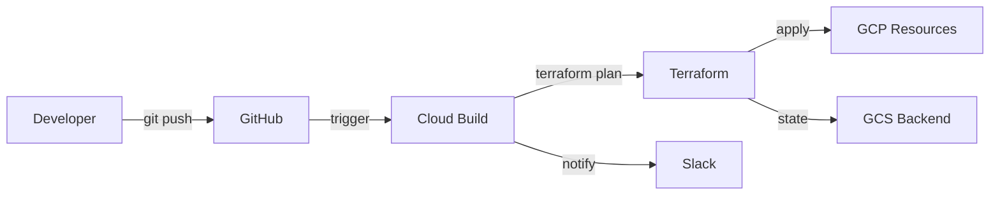
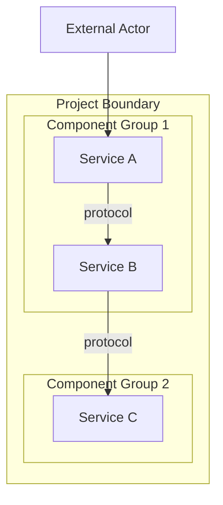

# Day 122 — Improve READMEs + Architecture Diagrams

> **Week 21 · Portfolio v2** | Prep 30 min | Activity 60 min | Revision 15 min | Quiz 15 min
>
> **Objective:** Transform basic READMEs into professional, recruiter-friendly documentation with clear architecture diagrams, badges, and structured content that makes your projects stand out.

---

## Part 1 — Concept: The Professional README (30 min)

### Why READMEs Matter

A README is often the **first and only thing** a recruiter or hiring manager looks at. A well-structured README signals:
- You can communicate technical concepts clearly
- You think about users/consumers of your work
- You document as part of your workflow (not as an afterthought)
- You understand production-level standards

### The Professional README Template

| Section | Purpose | Priority |
|---|---|---|
| **Title + One-liner** | Immediate understanding of what this is | Required |
| **Badges** | Quick status signals (CI, licence, Terraform version) | Recommended |
| **Architecture Diagram** | Visual understanding in 10 seconds | Required |
| **Problem Statement** | Why this project exists | Required |
| **Solution / What It Does** | What you built and how it works | Required |
| **Tech Stack** | Technologies at a glance | Required |
| **Prerequisites** | What's needed before setup | Required |
| **Quick Start / Setup** | Get running in <5 minutes | Required |
| **Usage** | How to use it day-to-day | Required |
| **Project Structure** | File/folder layout | Recommended |
| **Key Design Decisions** | Why you chose X over Y | Recommended |
| **Troubleshooting** | Common issues and fixes | Recommended |
| **What I Learned** | Growth signal for employers | Recommended |
| **Future Improvements** | Shows you think ahead | Optional |
| **Licence** | Legal clarity | Optional for portfolio |

### README Template

```markdown
# 🏗️ Project Name

> One-sentence description of what this project does and why it matters.


## Architecture

[Mermaid diagram or image here]

## Problem

[2-3 sentences about the real-world problem]

## Solution

[2-3 sentences about your approach]

## Tech Stack

| Technology | Purpose |
|---|---|
| Terraform 1.5+ | Infrastructure as Code |
| GCP Compute Engine | VM provisioning |
| Cloud Monitoring | Observability |
| Bash | Automation scripts |

## Prerequisites

- GCP project with billing enabled
- Terraform >= 1.5 installed
- gcloud CLI authenticated
- `europe-west2` region access

## Quick Start

[Step-by-step setup instructions]

## Project Structure

[Tree view of relevant files]

## Key Design Decisions

[Why you made specific architectural choices]

## What I Learned

[2-3 key takeaways]
```

### Architecture Diagrams with Mermaid

Mermaid diagrams render natively on GitHub — no image files needed.

**Common Diagram Types for Infrastructure Projects:**

| Diagram Type | Best For | Mermaid Syntax |
|---|---|---|
| **Flowchart** | Request/data flow | `graph LR` or `graph TD` |
| **Sequence** | Step-by-step processes | `sequenceDiagram` |
| **C4 / Block** | High-level architecture | `graph TD` with subgraphs |

**Example — VPC Architecture:**

````markdown

````

**Example — Monitoring Architecture:**

````markdown

````

**Example — Terraform Workflow:**

````markdown

````

### ASCII Diagrams (Fallback)

For environments that don't render Mermaid:

```
┌─────────────────────────────────────────────┐
│             GCP Project (europe-west2)       │
│  ┌──────────────┐    ┌──────────────┐       │
│  │ Public Subnet │    │ Private Sub  │       │
│  │  10.0.1.0/24 │    │ 10.0.2.0/24  │       │
│  │  ┌────────┐  │    │  ┌────────┐  │       │
│  │  │  NAT   │  │    │  │  VM-1  │  │       │
│  │  └────────┘  │    │  │  VM-2  │  │       │
│  └──────────────┘    │  └────────┘  │       │
│                      └──────────────┘       │
│  ┌──────────────────────────────────┐       │
│  │   Firewall Rules (IAP, HTTP)     │       │
│  └──────────────────────────────────┘       │
└─────────────────────────────────────────────┘
```

### Badges That Add Value

| Badge | Purpose | Markdown |
|---|---|---|
| Terraform version | Shows IaC standard | `` |
| GCP | Cloud platform | `` |
| Region | Deployment target | `` |
| Licence | Legal clarity | `` |
| Status | Project maturity | `` |

---

## Part 2 — Hands-On Activity: Upgrade Your READMEs (60 min)

### Exercise 1 — Audit Current READMEs (10 min)

For each of your top 3 projects, audit the existing README against this checklist:

| Section | Project 1 ✓/✗ | Project 2 ✓/✗ | Project 3 ✓/✗ |
|---|---|---|---|
| Clear title + one-liner | | | |
| Architecture diagram | | | |
| Problem statement | | | |
| Tech stack table | | | |
| Prerequisites listed | | | |
| Quick start instructions | | | |
| Project structure | | | |
| Design decisions | | | |
| What I learned | | | |

### Exercise 2 — Create Architecture Diagrams (20 min)

For each project, create a Mermaid diagram. Follow these rules:

1. **Keep it high-level** — show services, not implementation details
2. **Use subgraphs** for logical groupings (VPC, subnets, project boundary)
3. **Show data flow direction** with arrows
4. **Label connections** with protocols or descriptions
5. **Include external actors** (users, admins, internet)

**Practice template:**

````markdown

````

Create one diagram per project. Paste into your README and verify it renders on GitHub.

### Exercise 3 — Rewrite READMEs (30 min)

Using the template from Part 1, rewrite each project README. Allocate ~10 minutes per project.

**Checklist for each README:**

- [ ] Title is the project name, not "README" or "Project"
- [ ] One-liner explains what + why in under 15 words
- [ ] At least 2 relevant badges
- [ ] Mermaid architecture diagram present
- [ ] Problem statement is relatable (not just "this is a lab exercise")
- [ ] Tech stack is in a clean table format
- [ ] Prerequisites are specific (versions, tools, access needed)
- [ ] Quick start has numbered steps that someone can actually follow
- [ ] At least 2 design decisions explained with reasoning
- [ ] "What I Learned" section has 2-3 genuine takeaways
- [ ] No spelling errors or broken formatting

---

## Part 3 — Revision: Key Takeaways (15 min)

- **README is your project's first impression** — recruiters judge projects by documentation quality
- **Use the standard template:** title, badges, diagram, problem, solution, tech stack, prerequisites, quick start, structure, decisions, learnings
- **Mermaid diagrams render on GitHub** natively — use `graph TD` for architecture, subgraphs for logical grouping
- **Badges provide instant visual signals** — Terraform version, GCP, region, status
- **Problem statements should be relatable** — frame as real-world scenarios, not "lab exercise"
- **Design decisions show engineering maturity** — "I chose X over Y because Z"
- **Keep Quick Start to 5 steps or less** — if it's longer, something needs simplifying
- **ASCII diagrams are a good fallback** where Mermaid isn't supported
- **Project structure trees** help reviewers navigate your code quickly
- **"What I Learned" signals growth mindset** — hiring managers value this highly

---

## Part 4 — Quiz (15 min)

**Q1.** Why should you use Mermaid diagrams instead of screenshot images for architecture documentation in GitHub repositories?

<details><summary>Answer</summary>

Mermaid diagrams are **version-controlled** (they're just text in markdown), **easy to update** without graphic design tools, **render natively on GitHub**, load faster than images, are **accessible** (screen readers can parse the text), and don't require hosting or managing image files. They also signal to reviewers that you care about maintainable documentation. Screenshot images become outdated quickly and are harder to maintain.
</details>

**Q2.** A README has this Quick Start section: "1. Clone the repo. 2. Run Terraform. 3. Done." What's wrong with it and how would you improve it?

<details><summary>Answer</summary>

It's **too vague to be actionable**. A reviewer can't actually run the project from these instructions. Improved version:
1. Clone: `git clone https://github.com/user/project.git && cd project`
2. Set variables: `cp terraform.tfvars.example terraform.tfvars` and edit with your project ID
3. Authenticate: `gcloud auth application-default login`
4. Initialise: `terraform init`
5. Deploy: `terraform plan` then `terraform apply`

Each step should include the **exact command**, any required **inputs or variables**, and expected **output or verification step**.
</details>

**Q3.** What's the difference between a "design decision" section and a "tech stack" section, and why include both?

<details><summary>Answer</summary>

The **tech stack** section is a factual list of technologies used (Terraform, GCP, Bash). The **design decisions** section explains **why** you chose those technologies and architectural patterns over alternatives. For example: "Chose Cloud NAT over a NAT instance for managed scalability and reduced operational overhead." Tech stack shows **what**, design decisions show **thinking**. Hiring managers care more about your reasoning than your tool list — many engineers can list tools, fewer can justify their choices.
</details>

**Q4.** You have a project with a 200-line README. A recruiter will spend about 30 seconds on it. What should be in the first screen (top ~30 lines) to capture their attention?

<details><summary>Answer</summary>

The first screen should contain: (1) **Clear title** with a one-line description, (2) **Badges** showing key tech (Terraform, GCP, region), (3) **Architecture diagram** — a visual they can understand in 5 seconds, and (4) the **problem statement** — why this project matters. Everything else (setup instructions, file structure, learnings) can come below the fold. The goal of the first screen is to make them **want to scroll down**, not to explain everything. Think of it like a newspaper — headline, image, and lead paragraph above the fold.
</details>
